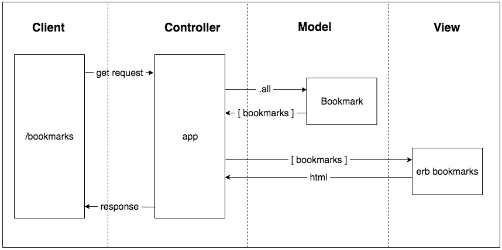

# Bookmark Manager

```
As a user,
So that I can view my bookmarks,
I would like to see a list of my bookmarks.
```


```
ln -sfv /usr/local/opt/postgresql/*.plist ~/Library/LaunchAgents launchctl load
```
```
~/Library/LaunchAgents/homebrew.mxcl.postgresql.plist
```

### How to create SQL database
```
brew install postgresql
```

```
ln -sfv /usr/local/opt/postgresql/*.plist ~/Library/LaunchAgents
```
```
launchctl load ~/Library/LaunchAgents/homebrew.mxcl.postgresql.plist
```
```
$> psql postgres
```
```
postgres=# CREATE DATABASE "your_user_name_here";
```
```
CREATE TABLE bookmarks(id SERIAL PRIMARY KEY, url VARCHAR(60));
```
